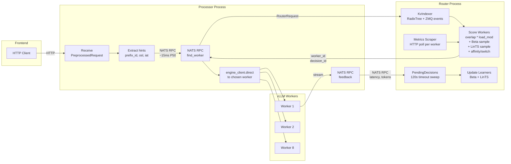
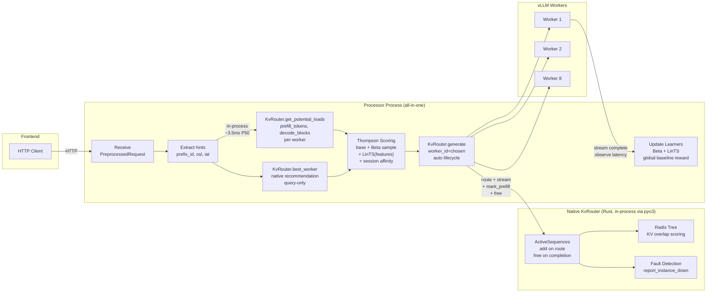
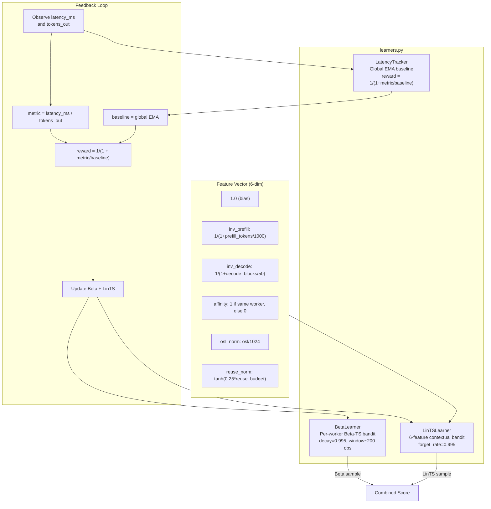

# Thompson Router Architecture

## Routing Modes

| Mode | Config Value | Description |
|------|-------------|-------------|
| `kv_native` | `router_type: kv_native` | Native KvRouter baseline (in-process, no learning) |
| `kv_thompson_native` | `router_type: kv_thompson_native` | Thompson + native KvRouter lifecycle (recommended) |
| `kv_thompson` | `router_type: kv_thompson` | Original Thompson via NATS RPC (legacy) |
| `kv_load` | `router_type: kv_load` | Dynamo formula replica (legacy, has cumulative counter bug) |

## Original Thompson Implementation (kv_thompson, via NATS RPC)

Two separate processes connected by NATS message queue. The processor
receives requests from the frontend, sends a routing RPC to the router,
then forwards to the chosen worker. Feedback flows back after completion.



### Issues Found in Original Implementation
- `NameError` in router.py log statement crashed every response before yield (100% feedback timeout)
- Cumulative `_kv_load_routed` counter (never decrements) caused request funneling in kv_load mode
- Per-worker EMA baselines equalized rewards to ~0.5 (no worker differentiation)
- No Beta decay (learner couldn't adapt to changing conditions)
- Two NATS round-trips per request (~15ms P50 overhead)
- Separate metrics scraper HTTP polling (stale data)

## New Thompson Implementation (kv_thompson_native, in-process)

Single process with Dynamo's native KvRouter running in-process via pyo3
Python bindings. Thompson scoring uses native load signals and manages
lifecycle through KvRouter's `ActiveSequences`.



### Improvements Over Original
- All routing in-process (no NATS RPC, 3.5ms vs 15ms overhead)
- Native `ActiveSequences` lifecycle (add, mark_prefill_complete, free)
- `get_potential_loads()` replaces HTTP metrics scraper (accurate, in-flight aware)
- Global EMA baseline for reward (differentiates workers)
- Beta decay=0.995 (adapts to changing conditions, half-life ~138 observations)
- Session affinity via prefix_id tracking (4.2x TTFT improvement)
- No separate router process needed

## Learner Components

Extracted into `learners.py` for modularity and testability:



## File Structure

| File | Purpose |
|------|---------|
| `processor.py` | Request handler with routing modes (kv_native, kv_thompson_native, thompson) |
| `router.py` | Original Thompson router (NATS RPC server, used by kv_thompson mode) |
| `learners.py` | Modular learner components (BetaLearner, LinTSLearner, LatencyTracker, PendingDecisions) |
| `kv_indexer.py` | KV cache overlap scoring (RadixTree + ZMQ event listener) |
| `config.yaml` | All configurable parameters |
| `test_thompson_learners.py` | Unit tests for learner components (71 tests) |
| `test_convergence.py` | Convergence and adaptability tests (33 tests) |

## Configuration

Set `router_type` in `config.yaml` under `infrastructure:`:

```yaml
infrastructure:
  router_type: kv_thompson_native  # recommended
  block_size: 16
```

For the original NATS-based Thompson router, also start `router.py` and set:

```yaml
infrastructure:
  router_type: kv_thompson
```
