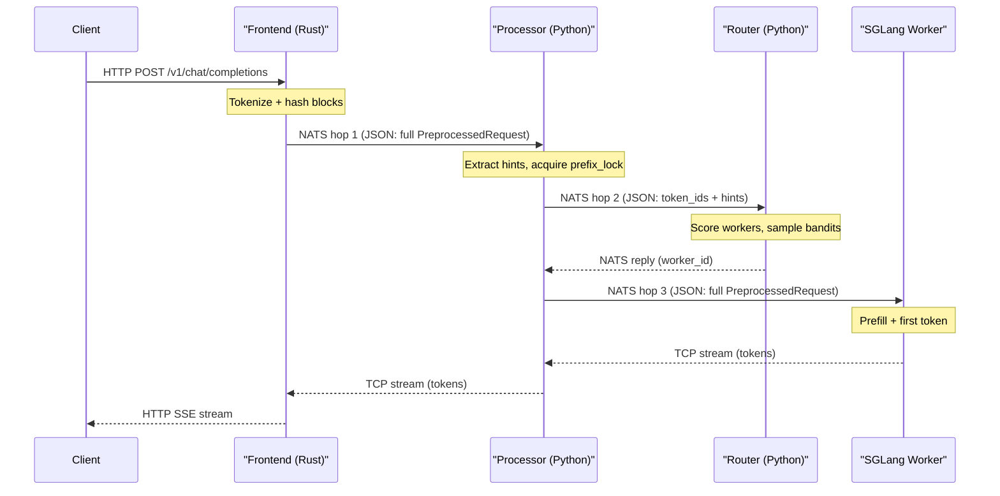

# Thompson Sampling Router: TTFT and ITL Optimization Audit

## Request Path Anatomy

Every millisecond before the first `yield` in the processor is TTFT. Every microsecond of per-chunk overhead in the streaming loop is ITL.

---

## Tier 1: High Impact, Low Complexity

### 1. Eliminate redundant `_worker_outstanding()` scans in router

**Current**: Called `(2W + 1)` times per request, each scanning ALL prefix entries O(P_prefix). With 8 workers and 500 prefixes = ~8,500 dict iterations per routing decision.

**Fix**: Pre-compute outstanding work for all workers in a single O(P_prefix) pass before the worker scoring loop in `_select_worker()`. Store result in a local `dict[int, tuple[int, float]]`.

**Files**: [router.py](external/dynamo/components/router.py) -- `_select_worker()` (line 1000), `_worker_outstanding()` (line 725)

**Estimated savings**: ~0.3-0.5ms per routing decision under load

### 2. Cache and reuse `_feature_vector` for the chosen worker

**Current**: `_feature_vector()` is called for every worker in `_select_worker()`, then called AGAIN for the chosen worker in `generate()` (line 1204). This also triggers a third `_worker_outstanding()` call.

**Fix**: Return the feature vector `x` for the chosen worker from `_select_worker()` along with `chosen_ctx`. Eliminates one full `_feature_vector` call + metrics scan + outstanding scan.

**Files**: [router.py](external/dynamo/components/router.py) -- `generate()` (line 1204), `_select_worker()` return value

**Estimated savings**: ~0.1ms per request

### 3. Pre-index metrics as `dict[worker_id, (gpu, queue)]`

**Current**: Both `_feature_vector()` and `_load_score()` do O(W) linear scans of `metrics["endpoints"]` list for each worker. Total: O(W^2) per request.

**Fix**: In `_build_internal_metrics()`, return a `dict[int, tuple[float, float]]` instead of `{"endpoints": [list of dicts]}`. All downstream lookups become O(1).

**Files**: [router.py](external/dynamo/components/router.py) -- `_build_internal_metrics()` (line 803), `_feature_vector()` (line 938), `_load_score()` (line 972)

**Estimated savings**: Eliminates ~16 dict iterations per request (with W=8)

### 4. Move `_sweep_pending()` to a background asyncio task

**Current**: Runs inline in `generate()` every 5 seconds. The unlucky request that triggers it pays the full cost of processing ALL expired decisions (bandit updates, lock acquisitions, optional I/O).

**Fix**: Start a periodic `asyncio.create_task()` in `initialize()` that runs `_sweep_pending()` independently. Remove the inline call from `generate()`.

**Files**: [router.py](external/dynamo/components/router.py) -- `generate()` (line 1167), `_sweep_pending()` (line 1119), `initialize()` (line 572)

**Estimated savings**: Eliminates periodic 1-10ms latency spikes

### 5. Fix error-path feedback to use fire-and-forget

**Current**: In `_stream_from_engine()`, error and exception paths `await _send_feedback_safely()` BEFORE yielding the error to the client. This delays error delivery by the full router RPC round-trip (~3-5ms).

**Fix**: Use `asyncio.create_task()` for error-path feedback, matching the happy-path pattern (line 706).

**Files**: [processor.py](external/dynamo/components/processor.py) -- lines 680 and 728

**Estimated savings**: 3-5ms faster error delivery

---

## Tier 2: Medium Impact, Medium Complexity

### 6. Replace O(P) pending scan with incremental counter

**Current**: `_build_internal_metrics()` iterates ALL pending decisions under `_pending_lock` on every request to count per-worker pending.

**Fix**: Maintain a `pending_per_worker: dict[int, int]` that increments when decisions are stored (line 1215) and decrements when popped (feedback line 1294 and sweep line 1129). The scan becomes O(1).

**Files**: [router.py](external/dynamo/components/router.py) -- `_build_internal_metrics()` (line 811), `generate()` (line 1215), `feedback()` (line 1294)

### 7. Eliminate duplicate computations after `_select_worker()`

**Current**: `generate()` re-computes `osl`, `iat`, `decode_cost`, `prefill_cost`, `iat_factor` (lines 1186-1191) even though `_select_worker()` already computed and returned them in `chosen_ctx`.

**Fix**: Read values from `chosen_ctx` dict instead of recomputing. Also eliminates the second `_get_prefix()` call (Finding 1.7).

**Files**: [router.py](external/dynamo/components/router.py) -- `generate()` (lines 1184-1213)

### 8. Stop sending full `token_ids` to the router

**Current**: The processor serializes the entire `token_ids` list (10K+ integers = ~70KB JSON) in the `RouterRequest` sent to the router. The router uses them for: (a) KV overlap hashing (b) `len(req.tokens)` for prefill cost.

**Fix**: With KV events disabled (current config), the overlap scoring returns empty scores anyway. Send only `token_count: int` instead of the full list. When KV events are re-enabled, send a pre-computed block hash list (much smaller than raw token_ids).

**Files**: [processor.py](external/dynamo/components/processor.py) -- `_pick_worker()` (line 527), [router.py](external/dynamo/components/router.py) -- `RouterRequest` model (line 359), `generate()` (line 1181)

**Estimated savings**: Eliminates ~70KB of JSON serialization per router RPC for 10K-token prompts

### 9. Defer KVE extraction to final chunk only

**Current**: `KVEfficiencyData.from_response(data)` runs on every chunk that has `"usage"` or `"nvext"` keys, creating a throwaway object each time. Some engines include these keys in every chunk.

**Fix**: Only extract KVE when `"finish_reason"` is present in the chunk (the final chunk), since that's the only one with meaningful usage data.

**Files**: [processor.py](external/dynamo/components/processor.py) -- `_stream_from_engine()` (lines 691-694)

---

## Tier 3: Architecture-Level (Largest Impact, Highest Complexity)

### 10. Switch request plane from NATS to TCP

**Current**: 3 NATS hops per request. Each hop: JSON serialize -> NATS publish -> NATS ack -> NATS deliver -> JSON deserialize. With 10K-token prompts, the full `PreprocessedRequest` (~70KB+ JSON) is serialized/deserialized 6 times (3 hops x 2).

**Fix**: Set `DYN_REQUEST_PLANE=tcp` in the container environment. This is an existing Dynamo configuration that replaces NATS with direct TCP + connection pooling for the request plane. Responses already use TCP. This eliminates the NATS broker from the latency-critical path entirely.

**Files**: [start_dynamo_optimized_thompson_hints_sglang.sh](external/dynamo/start_dynamo_optimized_thompson_hints_sglang.sh) -- add `-e DYN_REQUEST_PLANE=tcp` to the container `docker run` command

**Estimated savings**: 150-600us per request (3 NATS round-trips eliminated)

**Risk**: Needs testing -- TCP mode may have different failure semantics. NATS is still needed for KV events and JetStream, so the NATS container stays.

### 11. Reduce per-hop JSON bloat via binary serialization

**Current**: All NATS/TCP request payloads use `serde_json` (JSON text). A 10K-token `Vec<u32>` serializes as comma-separated decimal strings (~70KB) vs ~40KB raw binary.

**Fix**: This requires Dynamo framework changes (not in your control), but awareness is valuable. The TCP request plane mode may already use msgpack for some paths (per the enum docs). Investigate whether `DYN_REQUEST_PLANE=tcp` uses a more efficient serialization.

---

## Tier 4: Micro-Optimizations (Low Impact, Quick Wins)

### 12. Replace `np.random.beta()` with `random.betavariate()`

- NumPy's C round-trip for a single sample is ~3-5us. Python's stdlib is ~0.5us.
- Called W times per request. With 8 workers: saves ~20-36us.
- [router.py](external/dynamo/components/router.py) line 894

### 13. Skip Pydantic validation for internal RPCs

- `RouterRequest(**request)` + `req.model_dump()` is a validate-then-dump round-trip.
- Use raw dicts for processor-to-router and processor-to-engine RPCs.
- [processor.py](external/dynamo/components/processor.py) line 527, [router.py](external/dynamo/components/router.py) line 1159

### 14. Demote `logger.info()` to `logger.debug()` on TTFT path

- Two `logger.info()` calls with formatting on every request (processor lines 764, 779).
- Synchronous I/O if handler writes to stdout.
- [processor.py](external/dynamo/components/processor.py) lines 764 and 779

### 15. Pre-allocate NumPy feature vector buffer

- 9-element `np.array` allocation per worker per request (~2-5us each).
- Use a pre-allocated buffer filled in-place.
- [router.py](external/dynamo/components/router.py) line 956

---

## Recommended Implementation Order

| Priority | Item                                                          | TTFT Impact       | ITL Impact | Effort               |
| -------- | ------------------------------------------------------------- | ----------------- | ---------- | -------------------- |
| 1        | Pre-compute _worker_outstanding (item 1)                      | High              | None       | 1 hour               |
| 2        | Cache feature vector (item 2) + eliminate duplicates (item 7) | Medium            | None       | 1 hour               |
| 3        | Pre-index metrics dict (item 3)                               | Medium            | None       | 30 min               |
| 4        | Background sweep (item 4)                                     | Eliminates spikes | None       | 30 min               |
| 5        | Error-path feedback fix (item 5)                              | High (errors)     | None       | 15 min               |
| 6        | Incremental pending counter (item 6)                          | Medium            | None       | 30 min               |
| 7        | Stop sending token_ids to router (item 8)                     | Medium-High       | None       | 1 hour               |
| 8        | Defer KVE to final chunk (item 9)                             | None              | Low-Medium | 15 min               |
| 9        | DYN_REQUEST_PLANE=tcp (item 10)                               | Medium            | Low        | 15 min (config only) |
| 10       | Micro-optimizations (items 12-15)                             | Low               | Low        | 1 hour total         |

Items 1-6 are pure Python refactors in the router with no behavioral changes. Item 7-8 are processor changes. Item 9 is a single env var. Together, they should reduce per-request routing overhead from ~1-2ms to ~0.2-0.3ms and eliminate the periodic latency spikes entirely.